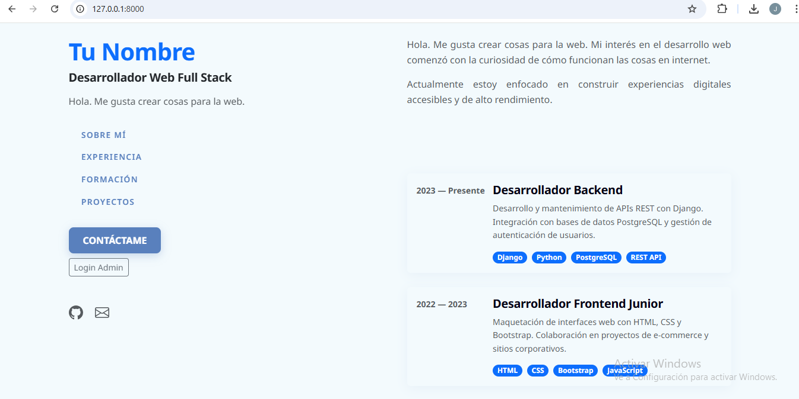
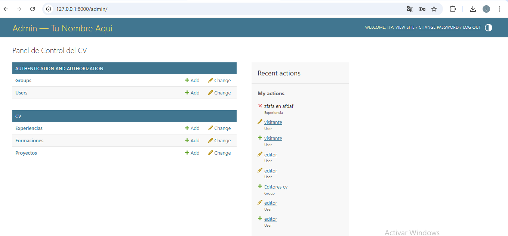
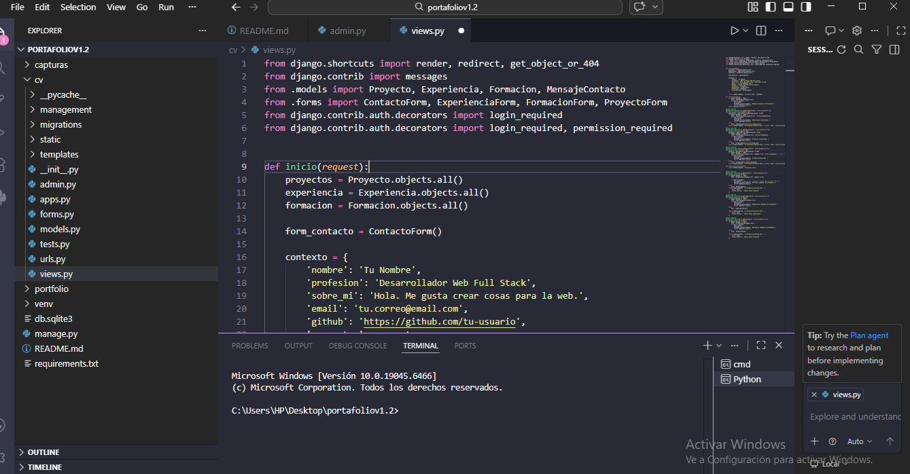

# 🗂️ Portafolio Personal — CV Dinámico con Django

> Aplicación web full-stack desarrollada con Django que permite presentar un currículum vitae profesional de forma dinámica. Los datos se gestionan desde una base de datos relacional y se administran a través de un panel con autenticación y control de permisos por roles.

**Módulo 6 — Desarrollo Web con Django | Alke Solutions**

---

## 📋 Tabla de contenidos

- [Descripción](#-descripción)
- [Tecnologías utilizadas](#-tecnologías-utilizadas)
- [Funcionalidades](#-funcionalidades)
- [Modelos de datos](#-modelos-de-datos)
- [Instalación y configuración](#-instalación-y-configuración)
- [Estructura del proyecto](#-estructura-del-proyecto)
- [Flujo de una petición](#-flujo-de-una-petición)
- [Panel de administración](#-panel-de-administración)
- [Capturas de pantalla](#-capturas-de-pantalla)
- [Dificultades encontradas](#-dificultades-encontradas)

---

## 📌 Descripción

Este proyecto es una aplicación web de portafolio personal construida con el framework **Django** siguiendo el patrón de arquitectura **MTV** (Model – Template – View). Permite gestionar y mostrar de forma dinámica la información profesional de una persona: experiencia laboral, formación académica y proyectos realizados.

A diferencia de un CV estático en HTML, toda la información se almacena en una base de datos y puede actualizarse en cualquier momento desde el panel de administración, sin necesidad de tocar el código.

---

## 🛠️ Tecnologías utilizadas

Tecnología	Versión	Uso
Python	3.14	Lenguaje base
Django	6.0.3	Framework web principal
PostgreSQL / Supabase	—	Base de datos en producción
SQLite	—	Base de datos en desarrollo
Bootstrap	5.x	Estilos y diseño responsivo
python-dotenv	1.0.1	Variables de entorno
dj-database-url	3.1.2	Conexión a BD desde URL
gunicorn	—	Servidor WSGI para producción
whitenoise	—	Archivos estáticos en producción

---

## ✨ Funcionalidades

### Sitio público

- **Página principal:** Presentación personal con nombre, descripción y enlaces de contacto.
- **Experiencia laboral:** Listado dinámico de cargos con empresa, período, descripción de tareas y tecnologías utilizadas, ordenados por el campo `orden`.
- **Formación académica:** Listado de títulos, certificados e instituciones con descripción, ordenados cronológicamente.
- **Proyectos:** Galería de proyectos con título, descripción, tecnologías usadas, imagen y enlaces opcionales a GitHub y al sitio en producción.
- **Formulario de contacto:** Formulario validado del lado del servidor con protección CSRF. Los mensajes se almacenan en la base de datos y son accesibles desde el panel de administración.

### Panel de administración

- **Autenticación segura:** Acceso al panel mediante usuario y contraseña con redirección automática tras el login.
- **Control de permisos por roles:** Se distingue entre superusuario (acceso total) y usuarios con permisos específicos por grupo (por ejemplo, solo puede editar proyectos).
- **Protección de vistas:** Las vistas de gestión están protegidas con `LoginRequiredMixin` y `PermissionRequiredMixin`, impidiendo el acceso sin autenticación.
- **Gestión de contenido:** Crear, editar y eliminar registros de Experiencia, Formación, Proyectos y Mensajes de contacto directamente desde el admin.

### Comando seed

- Comando personalizado `see_cv` que carga datos de demostración en la base de datos. Limpia los registros anteriores y los reemplaza con datos de ejemplo listos para visualizar.

---

## 🗃️ Modelos de datos

El proyecto define cuatro modelos en `cv/models.py`:

### `Experiencia`
Almacena cada posición laboral del CV.

| Campo | Tipo | Descripción |
|---|---|---|
| `periodo` | CharField | Rango de fechas (ej: 2022 – Presente) |
| `puesto` | CharField | Nombre del cargo |
| `empresa` | CharField | Nombre de la empresa |
| `descripcion` | TextField | Descripción de responsabilidades |
| `tecnologias` | CharField | Tecnologías separadas por coma |
| `orden` | IntegerField | Orden de aparición en pantalla |

### `Formacion`
Almacena la trayectoria académica.

| Campo | Tipo | Descripción |
|---|---|---|
| `periodo` | CharField | Año o rango de fechas |
| `titulo` | CharField | Nombre del título o certificado |
| `institucion` | CharField | Nombre de la institución |
| `descripcion` | TextField | Descripción del programa (opcional) |
| `orden` | IntegerField | Orden de aparición en pantalla |

### `Proyecto`
Almacena los proyectos del portafolio.

| Campo | Tipo | Descripción |
|---|---|---|
| `titulo` | CharField | Nombre del proyecto |
| `descripcion` | TextField | Descripción del proyecto |
| `tecnologias` | CharField | Tecnologías separadas por coma |
| `enlace_github` | URLField | URL del repositorio (opcional) |
| `enlace_sitio` | URLField | URL del sitio en producción (opcional) |
| `imagen` | ImageField | Imagen de portada del proyecto (opcional) |
| `orden` | IntegerField | Orden de aparición en pantalla |

### `MensajeContacto`
Almacena los mensajes enviados desde el formulario.

| Campo | Tipo | Descripción |
|---|---|---|
| `nombre` | CharField | Nombre del remitente |
| `email` | EmailField | Correo electrónico |
| `asunto` | CharField | Asunto del mensaje |
| `mensaje` | TextField | Cuerpo del mensaje |
| `fecha_envio` | DateTimeField | Fecha y hora de envío (automático) |

---

## 🚀 Instalación y configuración

Puedes iniciar este proyecto de dos formas: clonando el repositorio desde GitHub o extrayendo el archivo `.zip` adjunto.

```bash
# Opción A — Clonar desde GitHub
git clone https://github.com/tu-usuario/tu-repositorio.git
cd tu-repositorio

# Opción B — Descomprimir el .zip
# Extrae el archivo y entra a la carpeta desde la terminal
cd portafoliov1.2
```

Una vez dentro de la carpeta del proyecto, ejecuta los siguientes pasos:

```bash
# 1. Crear el entorno virtual
python -m venv venv

# 2. Activar el entorno virtual
# Windows:
venv\Scripts\activate
# Mac / Linux:
source venv/bin/activate

# 3. Instalar dependencias
pip install -r requirements.txt
# 4. Configurar variables de entorno
cp .env.example .env
# Abre el archivo .env y completa los valores reales

# 5. Aplicar migraciones a la base de datos
python manage.py migrate

# 6. Cargar datos de demostración
see_cv

# 7. (Opcional) Crear superusuario para acceder al admin
python manage.py createsuperuser

# 8. Iniciar el servidor de desarrollo
python manage.py runserver
```

| URL | Descripción |
|---|---|
| http://127.0.0.1:8000/ | Sitio principal del portafolio |
| http://127.0.0.1:8000/admin/ | Panel de administración Django |

---
## 📁 Estructura del proyecto


```text
portafoliov1.2/
├── manage.py                        ← punto de entrada de comandos Django
├── requirements.txt                 ← dependencias del proyecto
├── README.md                        ← este archivo
├── .env.example                     ← plantilla de variables de entorno (sin datos reales)
├── .gitignore                       ← archivos ignorados por git
├── staticfiles/                     ← archivos estáticos recopilados (generado por collectstatic)
├── capturas/                        ← capturas de pantalla del proyecto
│   ├── sitio.png
│   ├── admin.png
│   └── codigo.png
├── portafolio/                      ← configuración principal del proyecto
│   ├── settings/                    ← configuración multi-entorno
│   │   ├── __init__.py              ← elige dev o prod según variable DJANGO_ENV
│   │   ├── base.py                  ← configuración común a ambos entornos
│   │   ├── development.py           ← desarrollo local (DEBUG=True, SQLite)
│   │   └── production.py           ← producción (DEBUG=False, Supabase, HTTPS)
│   ├── urls.py                      ← rutas raíz del proyecto
│   ├── wsgi.py                      ← punto de entrada para el servidor web
│   └── asgi.py                      ← punto de entrada asíncrono
├── cv/                              ← aplicación principal del portafolio
│   ├── models.py                    ← modelos: Experiencia, Formacion, Proyecto, MensajeContacto, Perfil
│   ├── views.py                     ← lógica de negocio de cada página
│   ├── urls.py                      ← rutas de la aplicación cv
│   ├── forms.py                     ← formularios ModelForm con validaciones
│   ├── admin.py                     ← registro y personalización del panel admin
│   ├── static/                      ← archivos estáticos de la app
│   │   └── cv/
│   │       ├── css/                 ← hojas de estilo personalizadas
│   │       └── img/                 ← imágenes e íconos
│   └── management/
│       └── commands/
│           ├── __init__.py
│           └── see_cv.py            ← comando para poblar la BD con datos iniciales del CV
└── templates/                       ← archivos HTML del proyecto
    ├── base.html                    ← plantilla base con navbar, footer y bloques reutilizables
    ├── login.html                   ← página de inicio de sesión
    ├── index.html                   ← página de inicio
    ├── experiencia.html             ← listado de experiencia laboral
    ├── formacion.html               ← listado de formación académica
    ├── proyectos.html               ← galería de proyectos
    └── contacto.html                ← formulario de contacto

---

## 🔄 Flujo de una petición

Cuando un usuario visita una URL (por ejemplo `/experiencia/`), Django procesa la solicitud siguiendo estos pasos:

```text
Navegador → urls.py → views.py → models.py → template.html → Navegador
```

1. **`urls.py`** — Django compara la URL recibida con los patrones definidos. Al encontrar coincidencia, delega el control a la vista correspondiente.
2. **`views.py`** — La función de vista recibe el `request`, consulta los datos necesarios a través del ORM de Django (`Experiencia.objects.all()`) y construye un diccionario de contexto.
3. **`models.py`** — El ORM traduce la consulta Python a SQL, accede a la base de datos y retorna los objetos del modelo.
4. **`template.html`** — Django combina el contexto con el template HTML usando el motor de plantillas. Las variables `{{ }}` y etiquetas `` se reemplazan con los datos reales.
5. **Respuesta HTTP** — El HTML final se envía al navegador del usuario como respuesta.

---

## 🔐 Panel de administración

El panel de administración de Django está disponible en `/admin/` e incluye las siguientes funcionalidades configuradas:

- **Modelos registrados:** Experiencia, Formación, Proyectos y Mensajes de Contacto visibles y editables desde el panel.
- **Columnas personalizadas:** Las listas muestran columnas relevantes (`list_display`) y filtros laterales (`list_filter`) para facilitar la navegación.
- **Grupos y permisos:** Se pueden crear grupos de usuarios con permisos específicos (ej: un editor que solo puede modificar proyectos, sin acceso a mensajes de contacto).
- **Protección de vistas:** Las vistas del sitio están protegidas con `LoginRequiredMixin` y `PermissionRequiredMixin`. El acceso no autenticado redirige al login automáticamente.

---

## 📸 Capturas de pantalla

**Página Principal**


**Panel de Administración**


**Código en VS Code**


---

## ⚠️ Dificultades encontradas

### Configuración de permisos en el admin

La mayor dificultad fue comprender la diferencia entre un superusuario (acceso total) y un usuario estándar con permisos asignados por grupo. Fue necesario estudiar en detalle el funcionamiento de `LoginRequiredMixin` y `PermissionRequiredMixin` para proteger correctamente las vistas según el tipo de usuario autenticado.

### Error en el comando seed

Al ejecutar `see_cv` por primera vez, se produjo el siguiente error:

```text
TypeError: Experiencia() got unexpected keyword arguments: 'habilidades'
```

El problema era una discrepancia entre el nombre del campo utilizado en el script (`habilidades`) y el nombre real definido en el modelo (`tecnologias`). Se resolvió revisando directamente `models.py` e igualando los nombres de campo en el script de seed.

---

*Desarrollado como parte del ABP — Módulo 6 Desarrollo Web con Django | Alke Solutions*
